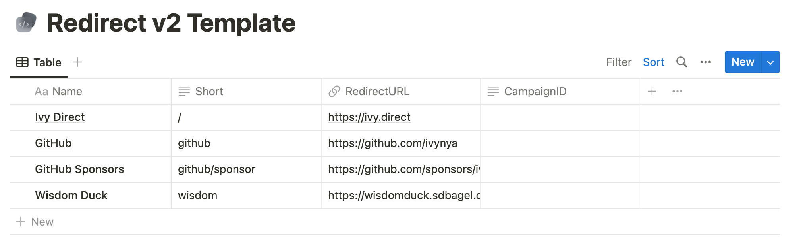

# redirect

Notion-integrated, Dockerized redirect API written in Go. Supports optional analytics integration with [`ivynya/analytics`](https://github.com/ivynya/analytics).

## Manage from Notion

| Property Name | Description |
| --- | --- |
| `Name` | The name of the redirect. Can be anything. |
| `Short` | The short URL to redirect from. May include `/` characters. |
| `RedirectURL` | The URL to redirect to. |
| `CampaignID` | The analytics campaign ID (see [`ivynya/analytics`](https://github.com/ivynya/analytics)). |

The `Short` property describes which route to map to the `RedirectURL`. For example, in the picture above, if you were hosting this redirect instance on `example.com`, then `https://example.com/github` will redirect to `https://github.com/ivynya`. The `Short` property can be prefixed with a `/`, like `/github`, or without and both will work. It can contain multiple `/` characters, like `/github/sponsors`.

The `CampaignID` integrates with an [`ivynya/analytics`](https://github.com/ivynya/analytics) instance. It corresponds to the `CampaignID` specified in an analytics campaign, and will track the number of times the link is accessed. It is OK to leave blank, but must be left blank if no analytics instance was configured in the environment.

Other properties do not have an effect on the redirect. Additional properties may be added to the Notion table (e.g. a multi-select for better grouping and sorting) and will not affect the redirect. However, modification of existing column names or types will break the redirect, so be careful.

## Host as Docker Container

> ⚠️ If you are upgrading from redirect V1 and using an older analytics instance, when configuring redirect v2 you must specify `ANALYTICS_VERSION=v2` in your .env file. If you are using the latest Go-based analytics instance, you can specify `v3` instead.

1. [Duplicate this Notion page](https://ivy.direct/template-redirect) and [find the database ID](https://developers.notion.com/docs/working-with-databases)
2. [Create a new Notion integration](https://www.notion.so/my-integrations), copy the API token, and invite it to your duplicated Notion page
3. Clone this repo and create a `.env` file with the ID and token, according to `.env.example`
4. Optionally, if running an [`ivynya/analytics`](https://github.com/ivynya/analytics) instance, add the info of the analytics server (ex: `analytics.example.com` and `v2`)
5. Run `docker run -p 3000:3000 -d ghcr.io/ivynya/redirect:latest`
6. Visit `http://localhost:3000/github` to test it works.

## Updating Redirects

`redirect` will automatically update the redirects when the Notion page is updated. At an absolute maximum, this takes 30 seconds as the database query is cached in-memory.

## Invalid Redirects

Invalid redirects will return a 404 not found error.

## License

MIT