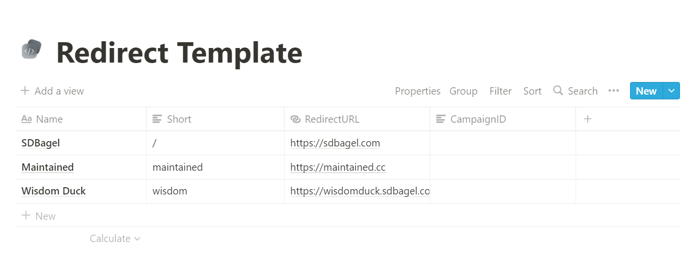

# redirect

Analytics-optional, Notion-integrated, Dockerized redirect API.

## Setup
1. Duplicate the Notion page and [find the database ID](https://developers.notion.com/docs/working-with-databases)
2. [Create a new Notion integration](https://www.notion.so/my-integrations), copy the API token, and invite it to your duplicated Notion page
3. Clone this repo and create a `.env` file with the ID and token, according to `.env.example`
4. Optionally, if running an [`SDBagel/analytics`](https://github.com/SDBagel/analytics) instance, add the host of the analytics server (ex: `analytics.mydomain.com`)
5. Run `docker build -t redirect .` and `docker run -p 8000:8000 -d redirect`

## Manage from Notion

The `Short` property describes which route to map to the `RedirectURL`. For example, `https://mydomain.com/:Short` will redirect to `:RedirectURL`. The `Short` property can be prefixed with a `/`, like `/maintained`, or without. It can contain multiple `/` characters, like `/maintained/onboarding`.

The CampaignID integrates with an [`SDBagel/analytics`](https://github.com/SDBagel/analytics) instance. It corresponds to the CampaignID specified in an analytics campaign, and will track the number of times the link is accessed. It is OK to leave blank, but must be left blank if no analytics instance was configured in the environment.

## Updating Redirects

`redirect` will automatically update the redirects when the Notion page is updated. At an absolute maximum, this takes 30 seconds as the database query is cached.

## Invalid Redirects

Invalid redirects will return a 400 non-existent redirect error.